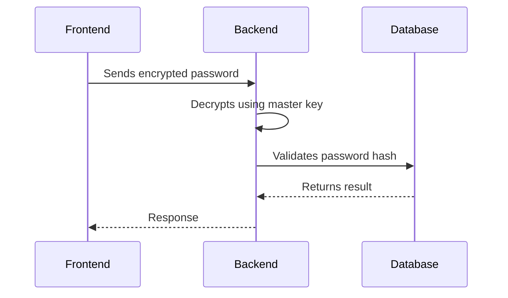
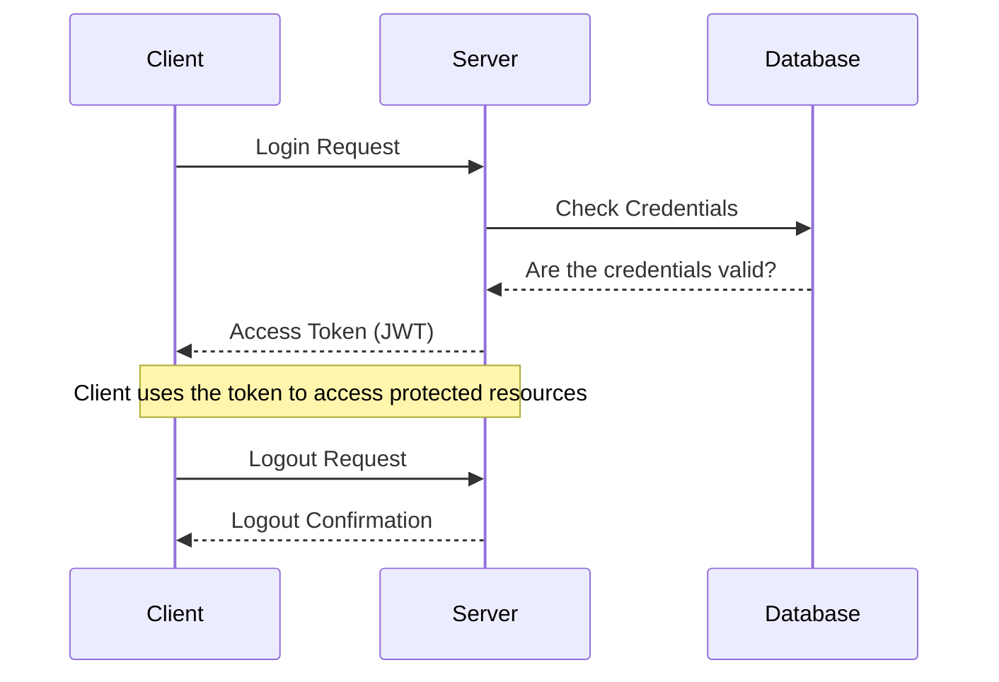
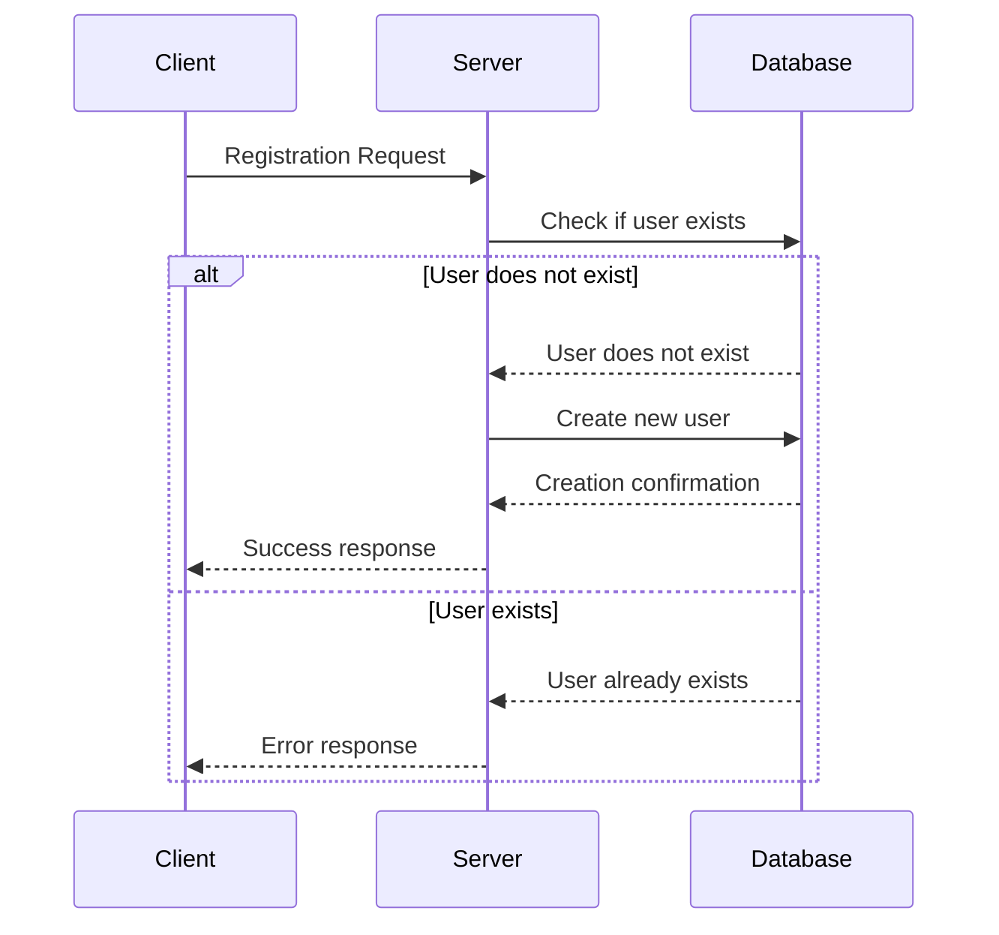
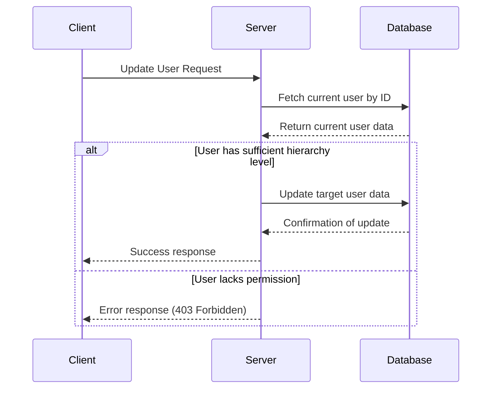

# BackEnd Project ManageEmployees.Api | BE Login

## **Module Overview**

This module is an essential part of the employee management system, responsible for authentication, user management, and route protection. It implements features such as secure login, JWT token generation, hierarchy-based authentication, and role control.

## **🖑 Index**

-   📉 [Prerequisites](#prerequisites)
-   🔧 [Environment Setup](#environment-setup)
-   🗂️ [Folder Structure](#folder-structure)
-   🌐 [Architecture](#architecture)
-   🛠️ [Libraries and Frameworks](#libraries-and-frameworks)
-   🔐 [Encryption and Sensitive Data Protection](#encryption)
-   🔧 [Environment Variables](#environment-variables)
-   🌐 [API Endpoints](#api-endpoints)
    -   [1. /SignIn](#1-signin)
    -   [2. /SignUp](#2-signup)
    -   [3. /Update/{userId}](#3-update)
    -   [4. /Delete/{userId}](#4-delete)
    -   [5. /ListAll](#5-listall)
    -   [6. /SignOut](#6-signout)
-   🔁 [Registration and Authentication Flows](#flows)
    -   [1. Login Flow (/SignIn)](#login-flow)
    -   [2. User Registration Flow (/SignUp)](#registration-flow)
    -   [3. User Update Flow (/Update/{userId})](#update-flow)
-   📊 [Migrations](#migrations)
-   🔐 [Security Configurations](#security)
-   🔮 [Unit Tests](#unit-tests)
-   ⚠️ [Error Management](#error-management)

----------

## **Prerequisites**<a id="prerequisites"></a>

-   **Database:** SQL Server with SQL Express configured.
-   **Connection String:**
    
    ```
    Server=localhost\SQLExpress;Database=ManageEmployees;Trusted_Connection=True;TrustServerCertificate=True;
    ```
    

----------

## **Environment Setup**<a id="environment-setup"></a>

1.  **Clone the repository:**
    
    ```bash
    git clone https://github.com/em2websolution/ManageEmployees.Api
    ```
    
2.  **Initial Setup:**
    
    -   Ensure SQL Server is running with SQL Express support.
    -   Configure the database using the connection string mentioned above.
3.  **Apply migrations:**
    
    -   Migrations will run automatically during system startup.
    
    ```bash
    app.RunMigrations();
    ```
    
4.  **Initial Seed:** The system automatically creates a default user on startup:
    
    ```json
    {
      "userName": "admin@company.com",
      "password": "41458f9cc3788aed9ab66ef0f8e5f32f:tCTVxwCUJ6BkRz9Hy8QRwA=="
    }
    ```
    
5.  **Run the project:**
    
    ```bash
    dotnet run
    ```
    

----------

## **Folder Structure**<a id="folder-structure"></a>

```plaintext
ManageEmployees.Api
ManageEmployees.Domain
ManageEmployees.Infra.CrossCutting.IoC
ManageEmployees.Infra.Data
ManageEmployees.Services
ManageEmployees.UnitTests

```

----------

## **Architecture**

The project follows Clean Architecture principles, dividing responsibilities into well-defined layers to ensure scalability, maintainability, and technology independence.

-   **ManageEmployees.Api:** Contains controllers and API interfaces.
-   **ManageEmployees.Domain:** Defines system entities, interfaces, exceptions, and business rules.
-   **ManageEmployees.Infra.CrossCutting.IoC:** Dependency injection configuration.
-   **ManageEmployees.Infra.Data:** Handles data access, entity configurations, and migrations.
-   **ManageEmployees.Services:** Implements application services like authentication and user management.
-   **ManageEmployees.UnitTests:** Houses unit tests.

----------

## **Libraries and Frameworks**

-   **ASP.NET Core:** For building modern and secure APIs.
-   **Entity Framework Core:** ORM for database interaction.
-   **Serilog:** For logging.
-   **Swagger:** For API documentation and testing.

----------

## **Encryption and Sensitive Data Protection**<a id="encryption"></a>

### **Best Practices**

-   User passwords are **encrypted on the frontend** before being sent to the backend, protecting against Man-in-the-Middle attacks.
    
-   A **master key** is used for encryption/decryption, configured in the environment variables file (.env).
    
    ```plaintext
    @my-secret-key-@
    
    ```
    

### **Encryption Flow**



----------

## **Environment Variables**

Environment variables are a secure and practical way to configure sensitive or environment-specific information in your project. In Next.js applications, they are defined in files like `.env` and accessed directly in the code.

### Configuration Example

#### `.env.local` File

```dotenv
# Frontend URL
NEXT_PUBLIC_APP_URL=http://localhost:3000

# Application Version
NEXT_PUBLIC_VERSAO=1.0.0

# Backend Base URL
NEXT_PUBLIC_BASE_URL=https://localhost:64715/

# Secret Key for Encryption
NEXT_PUBLIC_SECRET_ENCRYPT_KEY=@my-secret-key-@

```

----------

## **API Endpoints**

### 1. **/SignIn**<a id="1-signin"></a>

**Method:** POST

```json
{
  "userName": "admin@company.com",
  "password": "encrypted_password"
}

```

**Responses:**

-   200: Successful login.
-   400: Invalid credentials.

```json
{
	"accessToken": "string(token)",
	"refreshToken": "string(token)"
}

```

### 2. **/SignUp**<a id="2-signup"></a>

**Method:** POST

```json
{
  "firstName": "John",
  "lastName": "Doe",
  "email": "john.doe@example.com",
  "password": "StrongPassword123!",
  "confirmPassword": "StrongPassword123!",
  "role": "Employee"
}

```

**Responses:**

-   200: Successful registration.
-   400: Invalid data or user already exists.

```plaintext
Returns a token.

```

### 3. **User Update (/Update/{userId})**<a id="3-update"></a>

**Method:** PUT

```json
{
  "firstName": "Jane",
  "lastName": "Doe",
  "email": "jane.doe@example.com",
  "role": "Leader"
}

```

**Responses:**

-   200: User successfully updated.
-   400: Invalid data or update failed.

### 4. **User Deletion (/Delete/{userId})**<a id="4-delete"></a>

**Method:** DELETE

**Responses:**

-   200: User successfully deleted.
-   400: Error during deletion.

### 5. **List All Users (/ListAll)**<a id="5-listall"></a>

**Method:** GET

**Responses:**

-   200: User list successfully retrieved.
-   400: Error retrieving users.

### 6. **Logout (/SignOut)**<a id="6-signout"></a>

**Method:** POST

**Responses:**

-   200: Successfully logged out.
-   400: Logout failed.

----------

## **Registration and Authentication Flows**<a id="flows"></a>

### **Login Flow (/SignIn)**<a id="login-flow"></a>

-   The client makes a request to `/SignIn` with user credentials.
-   If authentication is successful, an access token is returned.
-   The token is used for other authenticated operations.



### **Registration Flow (/SignUp)**<a id="registration-flow"></a>

-   The client sends a request to `/SignUp` with the desired credentials.
-   If successful, the user can proceed with login.



### **User Update Flow (/Update/{userId})**<a id="update-flow"></a>



----------

## **Migrations**

1.  Create a migration:
    
    ```bash
    Add-Migration {MigrationName}
    
    ```
    

----------

## **Security Configurations**<a id="security"></a>

-   JWT tokens secured with strong keys.
-   Passwords encrypted on the frontend.

----------

## **Unit Tests** <a id="unit-tests"></a>

The **backend** project implements unit tests to ensure code reliability and maintainability. The following section summarizes the test coverage achieved, key areas tested, and improvements for future iterations.

---

### **1. Test Coverage Overview**

Using **FineCode Coverage**, the project achieved an impressive **95.9% line coverage (979 out of 1020 lines)**. This indicates that most of the application logic has been thoroughly tested. The breakdown of the test results is as follows:

| Metric                | Value              |
| --------------------- | ------------------ |
| **Assemblies Tested** | 3                  |
| **Classes Covered**   | 25                 |
| **Files Tested**      | 22                 |
| **Covered Lines**     | 979                |
| **Uncovered Lines**   | 41                 |
| **Branch Coverage**   | 67.1% (102 of 152) |

---

### **2. Coverage by Assembly**

#### **ManageEmployees.Domain**
- **Line Coverage**: 98.7%
- **Branch Coverage**: 88.8%
- **Key Tests**: Focuses on domain-level classes and validation rules.

#### **ManageEmployees.Services**
- **Line Coverage**: 89.1%
- **Branch Coverage**: 65.3%
- **Key Tests**: Focuses on service layer business logic, including user management and encryption.

#### **ManageEmployees.UnitTests**
- **Line Coverage**: 99.6%
- **Branch Coverage**: 61.1%
- **Key Tests**: Validates utility functions and edge cases in the project.

---

### **3. Unit Tests Implemented**

#### **AuthServiceTests**
- Validates the authentication flow, including:
  - Correct generation and validation of JWT tokens.
  - Handling of incorrect credentials and token expiration scenarios.
- Key Scenarios Covered:
  - Successful login with valid credentials.
  - Login failure with invalid credentials.
  - Token validation for protected resources.

#### **ConstantsTests**
- Ensures the correctness of constant values used throughout the application.
- Key Scenarios Covered:
  - Validation of constant configurations such as role hierarchies, default settings, and error messages.

#### **EncryptionServiceTests**
- Focuses on cryptographic functions, ensuring data is encrypted and decrypted securely.
- Key Scenarios Covered:
  - Validation of password encryption.
  - Successful decryption of valid data.
  - Handling of invalid encryption inputs.

#### **ExceptionsTests**
- Validates the handling of custom exceptions used for business logic errors.
- Key Scenarios Covered:
  - Throwing and catching of `BusinessException` for invalid user operations.
  - Validation of `ValidationException` for incorrect inputs.

#### **SignInRequestTests**
- Tests the request object for user login, ensuring:
  - Validation of required fields (`username` and `password`).
  - Handling of invalid request payloads.

#### **UserServiceTests**
- Focuses on core user-related operations such as:
  - Fetching user details.
  - Updating user roles.
  - Business rule validation for creating or updating employees.


----------

## **Error Management**

-   `BusinessException`: Business logic errors.
-   `ValidationException`: Data validation errors.

